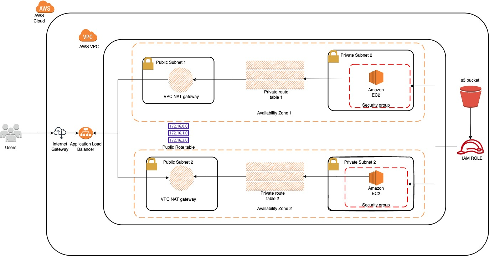
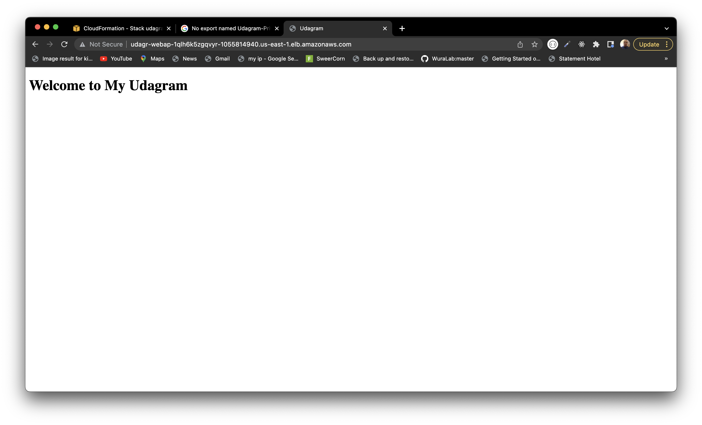

# Deploy a high-availability web app using CloudFormation

## Udagram (a high-availability web app using CloudFormation)

## Starter template

![Cloudformation] (https://github.com/nextwebb/nd9991-c2-Infrastructure-as-Code-v1)

## Architecture

Make your bash script executable on mac/linux: `chmod 700 create.sh update.sh`

Create service stack: `./create.sh udagram-highly-available-services-infra services.yaml parameters-services.json`

Update service stack: `./create.sh udagram-highly-available-services-infra services.yaml parameters-services.json`

Create network stack: `./create.sh udagram-highly-available-network-infra network.yaml parameters-network.json`

Update network stack: `./create.sh udagram-highly-available-network-infra network.yaml parameters-network.json`

## Output

Services stack complete the creation and outputs the website [`URL`](http://udagr-webap-1qlh6k5zgqvyr-1055814940.us-east-1.elb.amazonaws.com/).

## Web App Url

http://udagr-webap-1qlh6k5zgqvyr-1055814940.us-east-1.elb.amazonaws.com/

